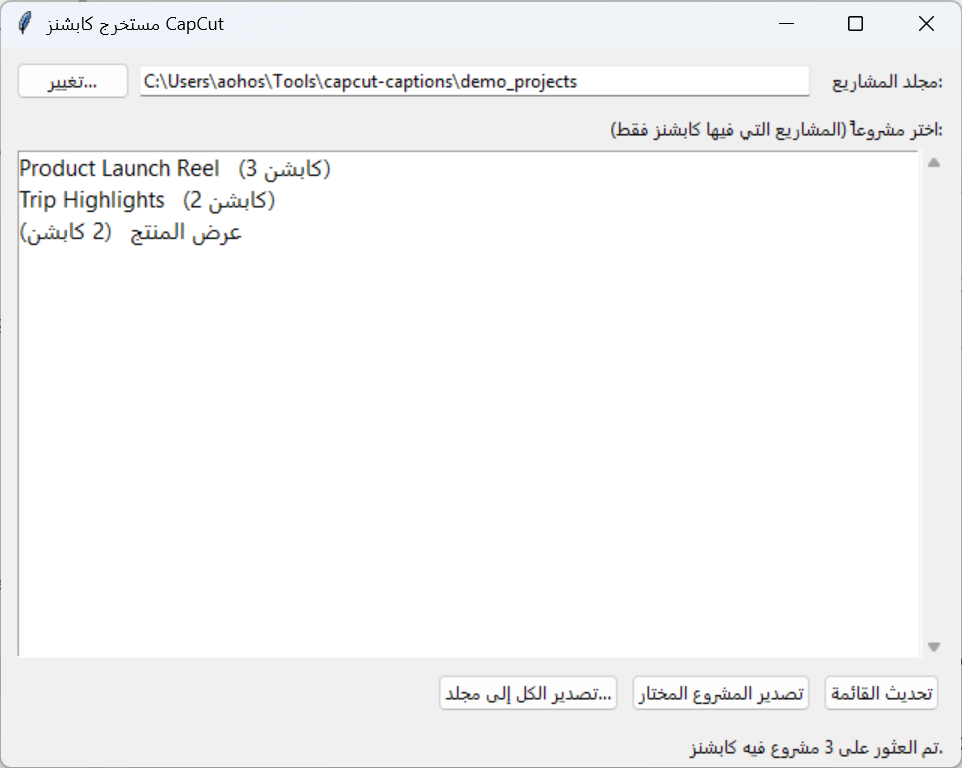

<div dir="rtl">

# مستخرج كابشنز CapCut → SRT



أداة مجانية ومفتوحة المصدر تسحب الكابشنز (النصوص) من مشاريع **CapCut** مع توقيتاتها الدقيقة، وتصدّرها كملفات **SRT** جاهزة للاستخدام في أي إديتور فيديو (Premiere, DaVinci Resolve, Final Cut, CapCut نفسه، يوتيوب...).

بدون الحاجة لتفريغ الكابشنز يدوياً من جديد، أو تثبيت أي إضافات — فقط بايثون (Python) وموجود مسبقاً على أغلب الأجهزة.

- **بدون تثبيت مكتبات إضافية** (Standard library فقط)
- يعمل على **Windows** و **macOS**
- واجهة رسومية بسيطة (اختر مشروع → اضغط زر → احصل على SRT) + سطر أوامر لمن يفضّله
- يدعم الكابشنز العادية وقوالب الكابشن الجاهزة من CapCut

---

## 1. المتطلبات

- **Python 3.10 أو أحدث**. تحقق بكتابة هذا في الطرفية (Terminal / PowerShell):
  ```bash
  python3 --version
  ```
  إن لم يكن مثبتاً، حمّله من [python.org/downloads](https://www.python.org/downloads/) (عند التثبيت على ويندوز، فعّل خيار **Add python.exe to PATH**).

- **macOS فقط**: تأكد أن تثبيتة بايثون تحتوي مكتبة tkinter (الواجهة الرسومية). النسخة الرسمية من python.org تأتي بها جاهزة. إذا كنت تستخدم Homebrew:
  ```bash
  brew install python-tk
  ```

---

## 2. التحميل

```bash
git clone https://github.com/abduosmanaj/capcut-captions-to-srt.git
```

أو حمّل المشروع كملف ZIP من زر **Code → Download ZIP** في أعلى الصفحة وفكّه.

---

## 3. تشغيل الواجهة الرسومية

| النظام | الطريقة |
|---|---|
| **Windows** | انقر نقراً مزدوجاً على `run_gui_windows.bat` |
| **macOS** | افتح الطرفية داخل مجلد المشروع ونفّذ مرة واحدة: `chmod +x run_gui_mac.command`، ثم انقر نقراً مزدوجاً على `run_gui_mac.command` (أو شغّله من الطرفية) |

ستظهر نافذة تعرض تلقائياً كل مشاريع CapCut التي تحتوي كابشنز، مع عدد الكابشنز أمام كل مشروع. اختر مشروعاً ثم اضغط **"تصدير المشروع المختار"** لحفظ ملف الـ SRT، أو **"تصدير الكل إلى مجلد..."** لتصدير كل المشاريع دفعة واحدة.

إذا لم يجد التطبيق مجلد CapCut تلقائياً (راجع القسم التالي)، اضغط **"تغيير..."** واختر المجلد الصحيح يدوياً.

---

## 4. أين مجلد مشاريع CapCut؟

الأداة تبحث تلقائياً في المسار الافتراضي حسب نظامك، لكن قد يختلف الموقع إذا غيّرت مكان تخزين المسودات من إعدادات CapCut. إليك كيفية إيجاده بنفسك بالطريقتين:

### الطريقة الأضمن (من داخل CapCut نفسه)

1. افتح CapCut → اذهب لصفحة **المشاريع / Projects** الرئيسية.
2. اضغط كليك يمين (أو الثلاث نقاط `⋯`) على أي مشروع.
3. اختر **"عرض في المستكشف" / Show in Explorer** (ويندوز) أو **"إظهار في Finder" / Reveal in Finder** (ماك).
4. سيفتح لك مجلد المشروع مباشرة — المجلد الذي يحتويه (الأب) هو مجلد `com.lveditor.draft` المطلوب.

### المسارات الافتراضية

**Windows:**
```
C:\Users\<اسم_المستخدم>\AppData\Local\CapCut\User Data\Projects\com.lveditor.draft
```
> ملاحظة: `AppData` مجلد مخفي. للوصول إليه مباشرة، اضغط `Win + R` واكتب:
> ```
> %LOCALAPPDATA%\CapCut\User Data\Projects\com.lveditor.draft
> ```

**macOS:**
```
~/Movies/CapCut/User Data/Projects/com.lveditor.draft
```
أي:
```
/Users/<اسم_المستخدم>/Movies/CapCut/User Data/Projects/com.lveditor.draft
```
> يمكنك أيضاً فتحه من Finder عبر `Cmd + Shift + G` ولصق المسار أعلاه.

إذا لم تجد المجلد في هذا المسار (مثلاً لأنك غيّرت موقع حفظ المسودات من إعدادات CapCut)، استخدم "الطريقة الأضمن" أعلاه، أو ابحث عن مجلد اسمه `com.lveditor.draft` باستخدام بحث النظام.

---

## 5. الاستخدام من سطر الأوامر (اختياري)

للمستخدمين المتقدمين أو للأتمتة (تشغيل دوري، سكربتات...):

```bash
# تصدير كل المشاريع التي فيها كابشنز (تلقائياً بجانب كل مشروع)
python3 capcut_captions_to_srt.py

# تصدير مشروع واحد فقط
python3 capcut_captions_to_srt.py --project "اسم_المشروع"

# تحديد مجلد مشاريع مختلف ومجلد حفظ مخصص
python3 capcut_captions_to_srt.py --projects-dir "D:\CapCut Projects" --output-dir "D:\SRT Exports"
```

---

## 6. كيف تعمل الأداة؟

CapCut يخزّن كل مشروع في ملف `draft_content.json`. الأداة تقرأ منه:

- كل مقطع نصي (`tracks` من نوع `text`) مع توقيته الدقيق (`target_timerange`).
- النص المرتبط به من `materials.texts`، أو — في حالة استخدام قالب كابشن جاهز من مكتبة CapCut — عبر `materials.text_templates`.

ثم ترتّب كل الكابشنز زمنياً وتحوّل التوقيتات (ميكروثانية) إلى صيغة SRT القياسية `HH:MM:SS,mmm`.

---

## الترخيص

[MIT](LICENSE) — استخدم، عدّل، وزّع بحرية.

</div>
